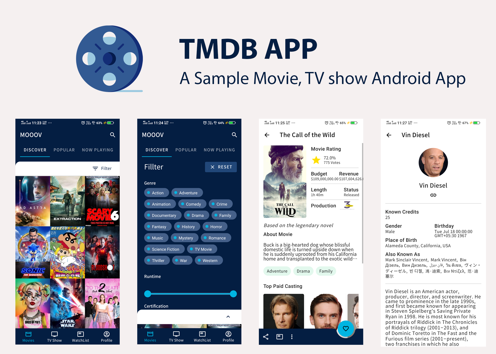

# TMDB App (work-in-progress 👷🔧️👷‍♀️⛏)

[](LICENSE)


**TMDB** is a sample Movies, and Tv shows Android application 📱 built to demonstrate use of *Modern Android development* tools. Dedicated to all Android Developers with ❤️.


## About
It simply loads **Movies** **Tv shows** data from API and stores it in persistence storage (i.e. SQLite Database). Posts will be always loaded from local database. Remote data (from API) and Local data is always synchronized. 
- This makes it offline capable 😃. 
- Clean and Simple Material UI.
- It supports dark theme too 🌗.


## Built With 🛠
- [Kotlin](https://kotlinlang.org/) - First class and official programming language for Android development.
- [Coroutines](https://kotlinlang.org/docs/reference/coroutines-overview.html) - For asynchronous and more..
- [Flow](https://kotlin.github.io/kotlinx.coroutines/kotlinx-coroutines-core/kotlinx.coroutines.flow/-flow/) - A cold asynchronous data stream that sequentially emits values and completes normally or with an exception.
- [Android Architecture Components](https://developer.android.com/topic/libraries/architecture) - Collection of libraries that help you design robust, testable, and maintainable apps.
  - [LiveData](https://developer.android.com/topic/libraries/architecture/livedata) - Data objects that notify views when the underlying database changes.
  - [ViewModel](https://developer.android.com/topic/libraries/architecture/viewmodel) - Stores UI-related data that isn't destroyed on UI changes. 
  - [ViewBinding](https://developer.android.com/topic/libraries/view-binding) - Generates a binding class for each XML layout file present in that module and allows you to more easily write code that interacts with views.
  - [Room](https://developer.android.com/topic/libraries/architecture/room) - SQLite object mapping library.
- [Dagger 2](https://dagger.dev/) - Dependency Injection Framework
- [Retrofit](https://square.github.io/retrofit/) - A type-safe HTTP client for Android and Java.
- [Coil-kt](https://coil-kt.github.io/coil/) - An image loading library for Android backed by Kotlin Coroutines.
- [Material Components for Android](https://github.com/material-components/material-components-android) - Modular and customizable Material Design UI components for Android.

## Contribute
If you want to contribute to this library, you're always welcome!
See [Contributing Guidelines](CONTRIBUTING.md). 

## Contact
If you need any help, you can connect with me.

## License
```
MIT License

Copyright (c) 2020 Hari Singh Kulhari

Permission is hereby granted, free of charge, to any person obtaining a copy
of this software and associated documentation files (the "Software"), to deal
in the Software without restriction, including without limitation the rights
to use, copy, modify, merge, publish, distribute, sublicense, and/or sell
copies of the Software, and to permit persons to whom the Software is
furnished to do so, subject to the following conditions:

The above copyright notice and this permission notice shall be included in all
copies or substantial portions of the Software.

THE SOFTWARE IS PROVIDED "AS IS", WITHOUT WARRANTY OF ANY KIND, EXPRESS OR
IMPLIED, INCLUDING BUT NOT LIMITED TO THE WARRANTIES OF MERCHANTABILITY,
FITNESS FOR A PARTICULAR PURPOSE AND NONINFRINGEMENT. IN NO EVENT SHALL THE
AUTHORS OR COPYRIGHT HOLDERS BE LIABLE FOR ANY CLAIM, DAMAGES OR OTHER
LIABILITY, WHETHER IN AN ACTION OF CONTRACT, TORT OR OTHERWISE, ARISING FROM,
OUT OF OR IN CONNECTION WITH THE SOFTWARE OR THE USE OR OTHER DEALINGS IN THE
SOFTWARE.
```
